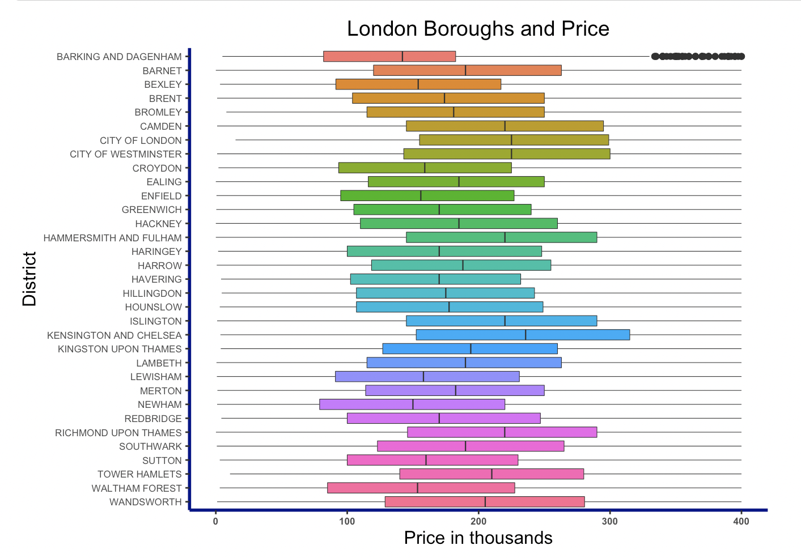
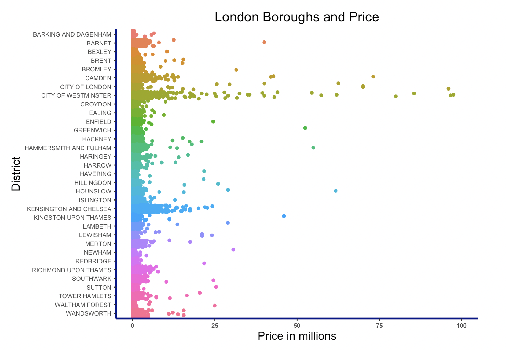
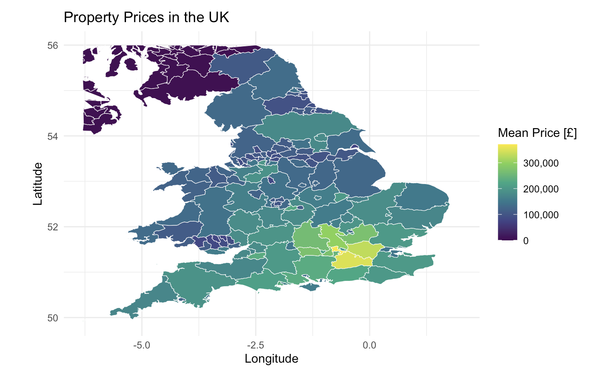
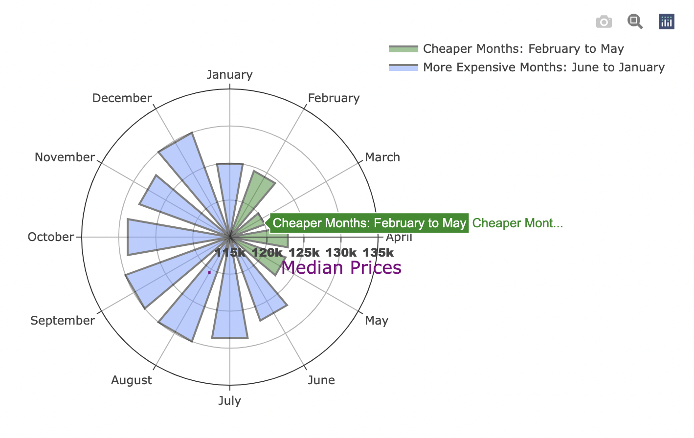
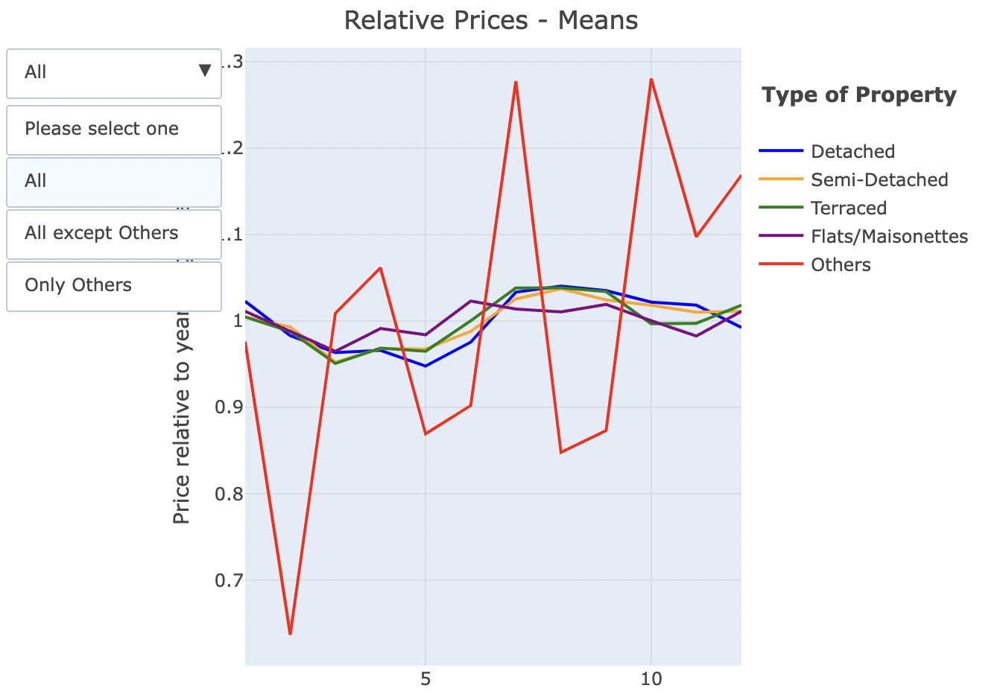

# What is this project about?
 In this project the idea is to create visualizations in R. The main libraries used are `dplyr` and `plotly`. The data we analyze is UK house prices from the Land Registry [1,2]. The type of visualizations created ranges from boxplots and violins to geographic plots and polar bars.

The following are some of the plots created, for the full code and the rest of the charts, please see the HTML or Rmd files.

1 https://www.gov.uk/government/collections/price-paid-data 

2 https://www.gov.uk/guidance/about-the-price-paid-data#explanations-of-column-headers-in-the-ppd
